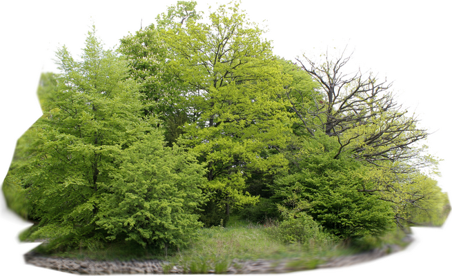

# treedashboard
Hamburg tree dashboard

Use the information provided by the ["Straßenbaumkataster"](https://api.hamburg.de/datasets/v1/strassenbaumkataster) to display information on public trees in Hamburg on a streamlit dashboard.

Data source:  Freie und Hansestadt Hamburg, Behörde für Umwelt, Klima, Energie und Agrarwirtschaft

